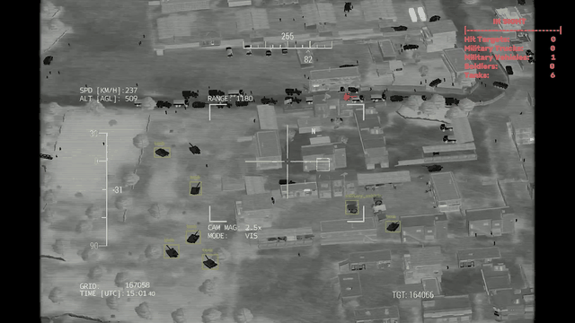
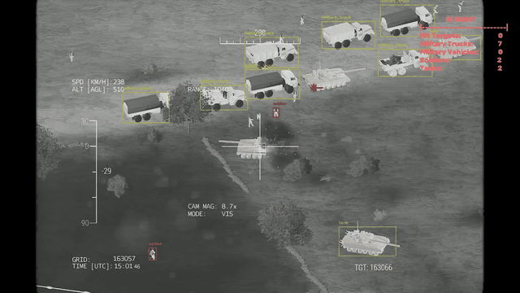
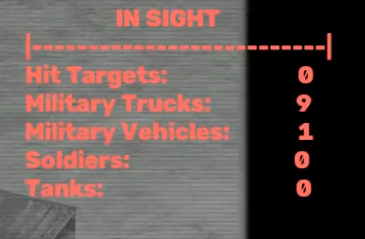
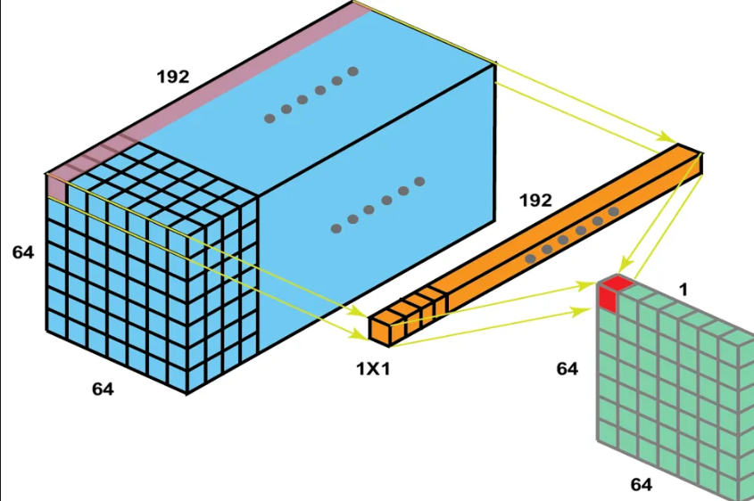
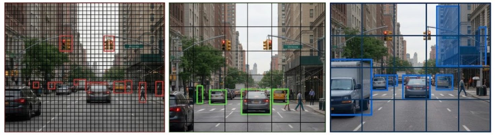
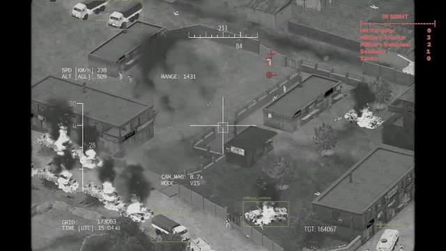
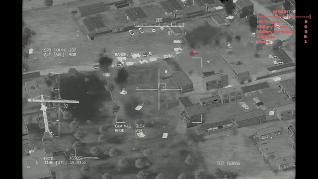

> Dil: Türkçe 🇹🇷


İngilizce için: [İngilizce](README.md)

# Tanım
<br>

- Bu proje için, fine-tune edilecek bir YOLOv8s modeli kullandım. Şuanda model tanklar, askeri araçlar, askeri tırlar ve askerler gibi askeri nesneleri tespit edebiliyor. Ayrıca vurulan hedeflerin sebep olduğu patlamaları da tespit edebiliyor.<br>



- Modelin bir başka yeteneği ise, anlık nesne sayısını aklında tutabilmesi ve ekrana bir sayaç olarak yansıtabilmesidir:<br>



### YOLO nesneleri nasıl tespit eder?
- YOLO modelleri Ultralytics tarafından geliştirilen bilgisayarlı görü modelleridir. YOLO modelleri FCN (Tam Evrişimli Ağlar) kullanır. Bu, yapıda hiçbir tam bağlantılı katman bulunmadığı anlamına gelir. Onun yerine, karar yapısı olarak 1x1 boyutundaki evrişim filtreleri kullanılır.<br>


- Büyük mavi blok, CNN'in özellik çıkarma aşaması sırasında oluşturulmuş 192 özellik haritasını temsil eder. Uzun sarı blok 192 sub-filtreyi gösterir (bu sub filtreler back-prop aşamasında güncellenir), ve sonuncu yeşil blok 1x1 evrişim filtresinin sonuç tensorunu ifade eder.
- 1x1'lik evrişim filtrelerinin sayısı sınıf sayısına bağlıdır. Ama ilk dördü her zaman aynı şeyi gösterir:  
    - İlk filtre = x sapması
    - İkinci filtre = y sapması
    - Üçüncü filtre =  genişlik 
    - Dördüncü filtre = yükseklik<br>
    
    Geri kalan filtreler, sınıfların olasılıklarını temsil eder.
- Genelde çıktı tensoru için üç çeşit shape vardır. Bunlar 80x80, 40x40 ve 20x20'lik gridlerdir.  
    - 80x80 gridler küçük nesneleri tespit eder
    - 40x40 gridler orta boydaki nesneleri tespit eder
    - 20x20 gridler büyük nesneleri tespit eder<br>


> Daha büyük gridler, daha büyük nesneleri tespit eder.
- YOLO modeli bir görsel aldığında, görsele sadece bir kez bakarak o görsel üzerinde tam 8400 kutu çizer (80x80 gridden 6400 , 40x40 gridden 1600 ve 20x20 gridden 400 kutu gelir). İsmini zaten buradan almıştır (You Look Only Once).
- Daha sonra en yüksek conf değerine sahip olan kutuyu seçer. Sonrasında, IoU kuralına göre diğer kutuları eler. IoU kutular arasındaki uyum oranını ifade eder. (IoU = Kesişim / Birleşim)

### Veri seti hazırlama
Modeli eğitmek için iki veri setini birleştirdim:<br>
- İlk veri seti için bir IHA çekiminden kareler almak için bir [pipeline](preparing-data/synthetic-data-pipeline.py) kullandım . Saniyede 2 kare ve toplamda 1156 kare elde ettim.
Daha sonra her bir karedeki nesneleri etiketlemek için Roboflow kullandım. İndirmeden önce veri setine ön işleme ve augmentation uyguladım:     
    - Ön-işleme: **Resize** (640x640,with black edges) 
    - Augmentation: **Flip**(horizontal) , **Crop**(0-15%) , **Exposure**(-9% to 9%)
    - Eğitim verisi başına 3 çıktı üretildi. Veri setinin final versiyonunda 2722 görsel vardı (2382 eğitim, 227 doğrulama ve 113 test).
- İkinci veri seti için, mevcut yapay veri setini desteklemek için [Military Footage Dataset](https://universe.roboflow.com/magisterka-gdfg0/military_footage_recognition) veri setini kullandım. Bu veri seti Toplar, Araba , Patlama , Askeri tır, Askeri araç , Asker, Tank  ve Tır sınıflarından nesneler içeren 6149 görsel barındırıyor. Ön işleme ve augmentation işlemleri bu veri setine de uygulandı:  
    - Ön-işleme: **Resize** (640x640,with black edges)
    - Augmentations: **Flip** (Horizontal), **Crop** (0% minimum, 15% maximum), **Grayscale** (görsellerin %35'ine uygulandı), **Exposure** (-11% to 11%)
    - Eğitim verisi başına 2 çıktı üretildi. Veri setinin final versiyonu 11191 görsel içeriyordu (10084 eğitim, 1002 doğrulama ve 105 test)<br>
>[!NOTE]
> Fark edilebileceği üzere, Grayscale sadece ikinci veri setine uygulandı ve iki veri setine de sadece yatay flip uygulandı. Bunun sebebi dikey (vertical) flip işleminin muhtemelen modelin kafasını karıştıracak olması ve ilk veri setindeki görsellerin bir kısmının zaten grayscale formunda olmasıdır.
- İkinci veri seti 8 adet sınıf içeriyordu ama bazıları gereksizdi ve aynı sınıfı temsil ediyordu. 5 tanesine ihtiyacım olduğu için, Topçu ve araba sınıflarını silmek adına başka bir [pipeline](preparing-data/dataset-pipeline.py) kullandım . İlgili pipeline istenmeyen sınıfları içeren görsel ve etiket dosyalarını siler. Ek olarak, *Truck* sınıfı *Military_truck* sınıfı ile aynı nesneyi temsil ediyordu. Bu yüzden, *Truck* sınıfı silindi ve nesneleri *Military_truck* sınıfına atandı.

## Eğitim Detayları

Model 250 epoch boyunca eğitildi. Ama patience=30 parametresi eğitimi 77. epochta erkenden durdurdu. En iyi sonuçlar 47. epochta alındığı için best.pt olarak kaydedildi. Bu modelin çok daha fazla geliştirilebileceğini ve hem veri setini hem parametreleri çeşitlendirebileceğimi gösteriyor. Yine de, bence modelin şuanki performansı yeterli olmasa da kabul edilebilir ve bir başlangıç noktası olarak varsayılabilir.

**Model**: `YOLOv8s`<br>
**Görev**: `Askeri nesneleri tespit etme`<br>
**Epoch**: `250 (77. epochta erkenden durduruldu)` <br>
**Veri seti**: `İki veri setinin birleşimi` <br>
**Girdi görseli boyutu**: `640x640` <br>
**Batch boyutu**: `8` <br>
**Teknoloji Yığını**: , ,<br>
- YOLO model eğitimi anlamında bazı kritik parametreler var:  
    - device="cuda": Orta ölçekte bir proje olduğu için eğitimi GPU da çalıştırmak kıymetli. GPU üzerinde bitmesi üç buçuk saat aldı. CPU'da çalıştırsaydım çok daha fazla sürerdi.<br>
    - batch=8: Tek seferde işlenecek görsel sayısını düşürerek GPU'nun dinlenmesine, soğumasına yardımcı olur.<br>
    - patience=30: Belirli bir süre boyunca (burada 30 epoch) bir ilerleme görülmezse eğitimi yarıda keser. Bu projede işe yaradı.

## Takip Algoritması Detayları
- Takip kısmı çok fazla ayarlama gerektirdi. Modelin en iyi görünen çıktısına ulaşmak için her birini tek tek uyguladım.

    - Her şeyden önce, tespit edilen her nesnenin aynı kutu ve etiket renginde gözükmesini istemedim. Bu yüzden, plot() fonksiyonu yerine her bir kutuyu manuel çizmek için bir for döngüsü kullandım.
    - Ekranda nesnelerden kaçar tane olduğunu görmek istedim. Bu yüzden her bir sınıf için bir sayaç kullandım.
    - Kutular o kadar somut ve dikkat dağıtıcıydı ki, videodaki nesneleri göremiyordum. Bu yüzden, ekrana biraz saydamlık katmak için cv.AddWegiht() fonksiyonunu kullandım. Bununla birlikte, çıktı videosu dağınık görüntüsünden kurtuldu.
    - Nesnelerin sınıf isimleri, çıktı videosunun belirli kısımlarında istikrarlı değildi. Bunu çözmek adına, her bir takip id'sinin son 20 sınıf id'sini tutan bir sözlük yapısı kullandım. Modelin her bir kutu için en sık geçen class id'yi ekrana yansıtmasını sağladım. 
    - VsCode sesleri desteklemediği için çıktı videosunda ses yoktu. Bunu halletmek için, ham videonun sesini kopyalamak ve sonrasında çıktı videosuna aktarmak adına moveipy kütüphanesini kullandım.

## Model Çıktıları
- Model bir takip görevinde test edildi. Bir IHA Askeri konvoy takip videosunda (Bayraktar TB2 Arma 3 Simülatör) askeri nesneleri tespit etmeyi denedi. İlk iki çıktı projenin en başında izlenebilir: [Description](#description)
<div align="center">
  <h4>Çıktı 3</h4>
  
</div>
<div align="center">
  <h4>Çıktı 4</h4>
  
</div>
<div align="center">
  <h4>Çıktı 5</h4>
  
</div>

### Kurulum ve kullanım
- Modeli 5 sınıftan askeri nesneleri tespit etmesi için fine tune ettim. Bu sebeple, bu nesneleri içeren herhangi bir video ya da çekiminiz varsa aşağıdaki adımları takip ederek modeli deneyebilirsiniz.<br>

1-
```bash
#Repoyu kopyala 
git clone https://github.com/halileroglu711/UAV-Military-Convoy-Tracking.git
```
2-
```bash
#Proje dosyasına gir
cd UAV-Military-Convoy-Tracking
```
3-
```bash
#Gereksinimleri yükle
pip install -r requirements.txt
```
4-
```bash
#Takibi başlat
python tracking.py
```
### Project Folder Structure
```text
UAV-Military-Convoy-Tracking/

├── assets/
│   ├── 1x1-convolution.png
│   ├── counter-sample.png
│   ├── grids-sample.png
│   ├── uav_tracking_demo.gif
│   ├── uav_tracking_demo1.gif 
│   ├── uav_tracking_demo2.gif
│   ├── uav_tracking_demo3.gif
│   └── uav_tracking_demo4.gif  
│
│
├── preparing-data/
│   ├── dataset-pipeline.py
│   └── synthetic-data-pipeline.py
│
│
├── weights/
│   ├── best.pt
│
├── .gitignore
├── README_TR.md
├── README.md
├── requirements.txt
├── tracking.py
├── training.py
└── UAV-Military-Convoy-Tracking-output.mp4
```


### Lisans

### 📬 İletişim
- Herhangi bir hatam varsa bana bildirin🙋. Katkılarınızı bekliyorum 🙂.Bana buradan ulaşabilirsiniz:

[](https://www.linkedin.com/in/halil-ero%C4%9Flu-5505783a1)
[](https://github.com/halileroglu711)
[](mailto:halileroglu711@gmail.com)

